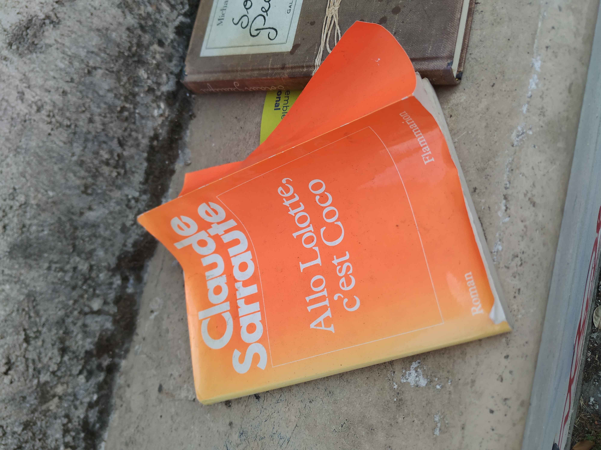
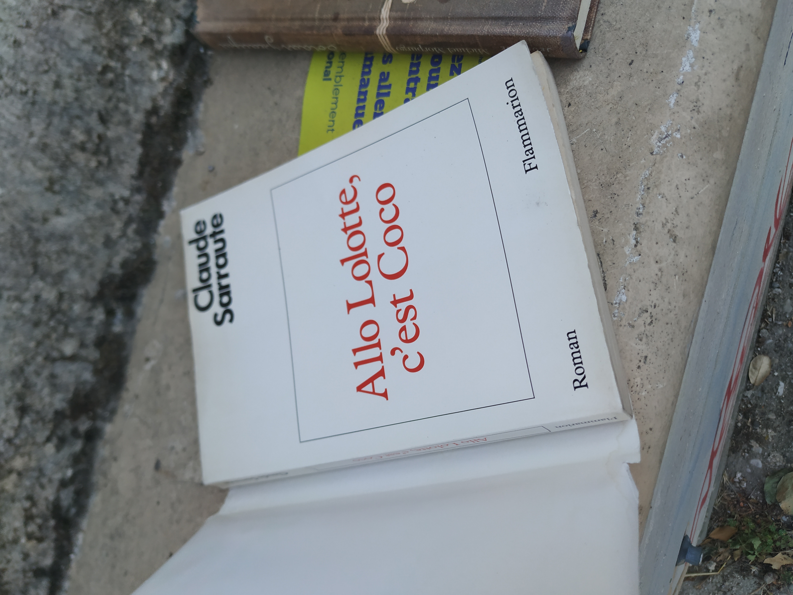
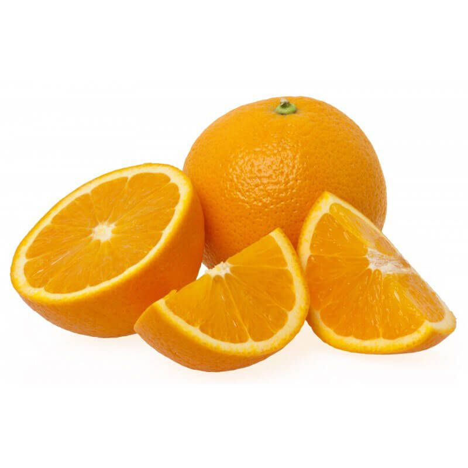

# My randonautica experiences 

## Experience 1

### Details 

- Intention: _orange fruit_
- Intention DateTime: _2020-07-01 20:02 CEST_
- Travel distance: _2.1 Km_

### Trip

I exist my home and I start walking to the destination.

The first thing that I notice is this unique orange flower:

Then a few meters of this flower a found this book:

When I approche to take a picture of it, the wind blew, and the page turn and I saw the first page of the book:

I arrive the destination a few meters, I saw this tree with a orange fruit:

I was expecting to find a Orange:

but this was also a orange fruit, and I consider the experience a success.

